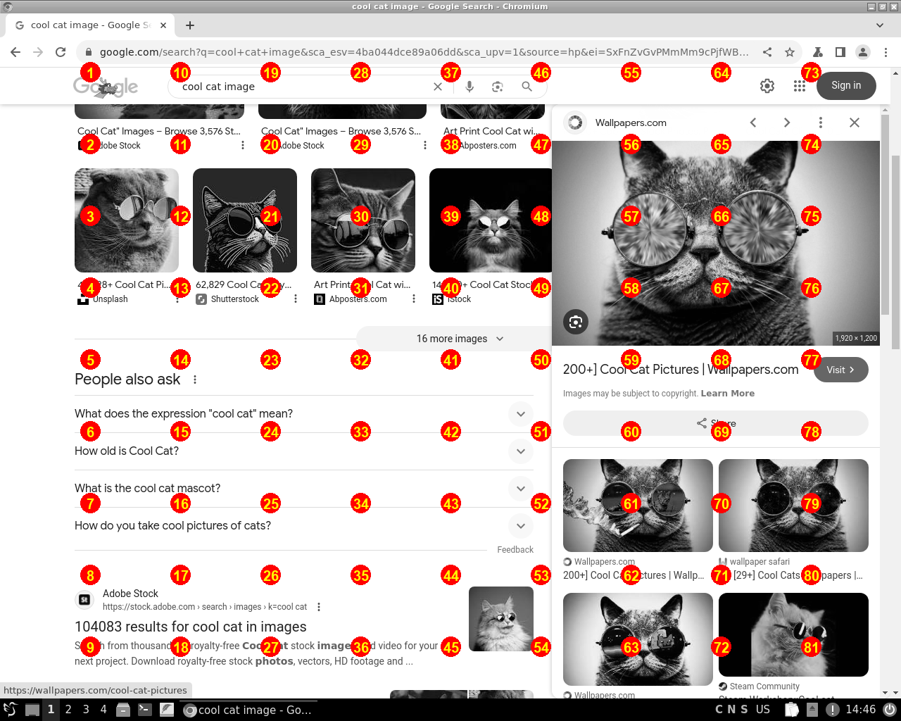
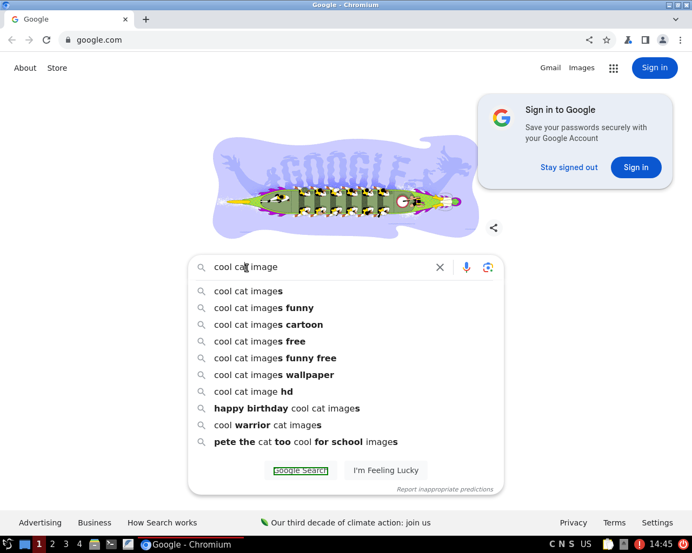

In this guide, we'll show how to create your own agent using SurfKit and some of the techniques we came up along the way to help your agent navigate GUIs and accomplish its goals. 

## Prerequisites

* Install `poetry` (see [Poetry docs](https://python-poetry.org/docs/)).
* Install `surfkit` (see [Quickstart](./quickstart)).
* Set up your local or cloud environment (see [Configuration](./configuration)).
* Install Tesseract on your machine (see [Tesseract docs](https://tesseract-ocr.github.io/tessdoc/Installation.html)).

## Creating an Agent

Creating a dummy agent that follows the SurfKit protocol is super easy:

```bash
mkdir surfhamster
cd surfhamster 
surfkit new
```

The last command will ask you to answer a few questions:

```
Enter agent name: SurfHamster
Describe the agent: The AI agent that can navigate GUIs and do tasks in them.
Enter git user reference (Your Name <your.email@gmail.com>): 
Enter docker image repo: 
Enter icon url (https://tinyurl.com/y5u4u7te): 
```

Feel free to leave the docker image repo empty for now and use a standard icon. When you run these commands, an Agent project will get initialized inside the folder you created. It contains all the components you need to give it a try:

```bash
surfkit create tracker -n hound001 -r docker 
```

```bash
surfkit create device -n eve001 -p qemu
```

```bash
surfkit create agent -n robby001 -r process
```

```bash
surfkit solve "Find a cool cat image in the internet" \
    --agent robby001 --device eve001 --tracker hound001 \
    --starting-url "google.com"
```

If the browser tab with a VM desktop and an agent log opens and the agent starts solving the task, 
congratulations: you just created your first agent!

## How does it work?

### Code

Let's briefly look inside the repo. There are a bunch of files there, but the most critical files are the following:

* `agent.yaml` is a configuration file; it contains a few self-explanatory sections: 
  * you will need to change the docker image repo later when you're ready to publish it; 
  * you may also want to change the icon; 
  * by default, your agent will run locally; 
  * this agent is designed to work with a “desktop” device as are the other GUI-driven agents that we build;
* `server.py` is just a utility class used to host the server with the agent process;
* `agent.py` is the main class that implements the logic of the agent: 
  * at the beginning of the task execution we explain to the MLLM/LLM what this agent is expected to do; 
  * then we enter the loop: 
    * given the task and the history of the chat, as well as the state of the desktop, we ask an 
    LLM to give us the next action and the reason for it; 
    * the next action is returned by LLM/MLLM as a JSON, which is checked against the available device and executed upon it;
  * we exit the loop when either the LLM returns an action marked as "result" (which means that it thinks 
  that the task is solved), or the maximum amount of iterations is reached (30 by default).

### Architecture

This type of agent works with a Desktop device. The Desktop device has an interface 
that allows it to control the VM (in the cloud or a local one) via a mouse and a keyboard programmatically. You've just created it above with `surfkit create device`.

When the agent works to solve a given task, it uses the device. The device implements 
the `Tool` interface and therefore has a schema of actions that the agent can take at any give time. We get this schema in JSON format, 
ask an MLLM/LLM to return the next action in that format, and then on each step of solving a task, 
we have an action that can be passed back to the device to be executed. 

For example, the action returned by MLLM/LLM, might look like this:

```json
{
  "observation": "The mouse cursor is positioned inside the Google search bar.",
  "reason": "To find a cat image, we need to type the search query 'cool cat images' into the search bar.",
  "action": {
    "name": "type_text",
    "parameters": {
      "text": "cool cat images"
    }
  }
}
```

When this object gets returned to a device, the device can execute it: in this case, type the text "cool cat images" using the keyboard.

The actions include the low-level operations of a mouse and a keyboard, like moving the mouse, clicking on coordinates, typing letters, and sending key commands. They also include taking the screenshot and getting the current mouse coordinates, which helps an MLLM to choose the next action towards the task completion.

The agent we just created works using these primitives: typing text and clicking the mouse. Cool, right? However, there is one little problem.

### Problem

And this is a big problem: at the time of this tutorial (June 2024, "gpt-4o" was released not so long ago), 
all frontier MLLMs are horrible at identifying coordinates of the object on a screenshot. They can reason quite well about what should be clicked or typed to achieve their goal, but they can't return correct coordinates for that value.

So it's time to make this agent better with some additional tricks.  Our goal is to help them  **convert an idea on what should be 
clicked into actual, correct screen coordinates**. To do that, we need to expand the toolset of our device and add a semantic 
layer to it, so that instead of "click on (400, 350)" our agent will return something like to "click on the big 'Search' button at the bottom of the screen".

From the code point of view, we'll do the following:

* We'll introduce the `SemanticDesktop` class, which is essentially a wrapper around the Desktop that we already have, and it inherits all the actions that it provides.
* We'll then update the `Agent` class to use the `SemanticDesktop` alongside the actual `Desktop`: we want the actions to be taken from and by `SemanticDesktop` and translated to the low-level `Desktop` operations when needed; 
we also want to keep using the screenshotting and mouse-clicking abilities from `Desktop`;
* After that, we'll introduce a new action to the `SemanticDesktop`: `click_object`.

## Adding SemanticDesktop

*Note*: You can find the code for this step of the tutorial 
[here](https://github.com/agentsea/surfhamster/tree/1fc5562be20c2731974222405160aef2f4168717).

First, we need to refine our `SemanticDesktop`. It will interit from `Tool`, which would allow us pass it to the MLLM.

See the full code for `tool.py` [here](https://github.com/agentsea/surfhamster/blob/1fc5562be20c2731974222405160aef2f4168717/surfhamster/tool.py).

The most interesting part of this class is that we add a new method, `click_object`:

```python
    @action
    def click_object(self, description: str, type: str) -> None:
        """Click on an object on the screen

        Args:
            description (str): The description of the object including its general location, for example
                "a round dark blue icon with the text 'Home' in the top-right of the image", please be a generic as possible
            type (str): Type of click, can be 'single' for a single click or
                'double' for a double click. If you need to launch an application from the desktop choose 'double'
        """
        info = self.desktop.info()
        screen_size = info["screen_size"]
        self._click_coords(screen_size["x"] // 2, screen_size["y"] // 2, "single")
```

As you can see, it is not so smart at the moment: it simply returns the coordinates in middle of the screen. Don't worry, we'll work on it later!

As we now have this class, we can update the `Agent` class too. See the full code for `agent.py` [here](https://github.com/agentsea/surfhamster/blob/1fc5562be20c2731974222405160aef2f4168717/surfhamster/agent.py).

Note that we replace some of the usages of the `Desktop` device by the `SemanticDesktop` 
device, but not all of them. The best way to explain it is that we get observations from the `Desktop` (a screenshot and mouse coordinates), but we run the actions of and by the `SemanticDesktop`. 

We also remove some actions we don't need our agent to know:

```python
        tools = semdesk.json_schema(
            exclude_names=[
                "move_mouse",
                "click",
                "drag_mouse",
                "mouse_coordinates",
                "take_screenshot",
                "open_url",
                "double_click",
            ]
        )
```

If you run the agent now, you'll notice in the console logs, that the schema (the available actions) have changed, and the agent can now return a new kind of action:

```python
{
  "observation": "The cursor is near the address bar and the search tab at the top left of the Google homepage.",
  "reason": "To search for a cool cat image, the next step is to type the search query into the Google search box located in the center of the screen.",
  "action": {
    "name": "click_object",
    "parameters": {
      "description": "the Google search box in the center of the screen",
      "type": "single"
    }
  }
}
```

The only problem now is that the implementation of this `click_object` function is still pretty dumb. So let's fix that now.

## Adding Grid

*Note*: You can find the code for this step of the tutorial 
[here](https://github.com/agentsea/surfhamster/tree/4a80d5f1fab16d61a0669ffca1507f6768c2b8dd). 
You'll need to add the fonts that you can see in the repository.

There are many ways to assist an MLLM in picking  the right location of the object on a screenshot. 
None of them are perfect (to the best of our knowledge at the moment of writing this tutorial), but combining a few in one agent can get you pretty high accuracy. Let's start with something simple.

We call this approach "The Grid". The idea is to put a bunch of dots with numbers in the corners of the cells on the NxN grid on a screen. 

Honestly, it's easier to show than to explain:



If we desaturate the original screenshot and put this grid on top, we can ask an MLLM which dot is the closest one to the place the agent wants to click (for example, a search bar or a button). In order to do that, 
we'll start a tiny thread with an MLLM (outside of the main thread) just to address this question. 

We then simply convert the number that an MLLM returns back to the coordinates on a screen.

First, we need to define a bunch of utility functions to generate this grid, merge it with the main image, and also convert images to and from b64 because it's the only image format gpt-4o accepts. See the code for `image.py` [here](https://github.com/agentsea/surfhamster/blob/4a80d5f1fab16d61a0669ffca1507f6768c2b8dd/surfhamster/image.py).

Now, we can update the `click_object` function to give it some more power and perception:

```python
    @action
    def click_object(self, description: str, type: str) -> None:
        """Click on an object on the screen

        Args:
            description (str): The description of the object including its general location, for example
                "a round dark blue icon with the text 'Home' in the top-right of the image", please be a generic as possible
            type (str): Type of click, can be 'single' for a single click or
                'double' for a double click. If you need to launch an application from the desktop choose 'double'
        """

        if type != "single" and type != "double":
            raise ValueError("type must be'single' or 'double'")

        color_number = os.getenv("COLOR_NUMBER", "yellow")
        color_circle = os.getenv("COLOR_CIRCLE", "red")

        click_hash = hashlib.md5(description.encode()).hexdigest()[:5]

        class ZoomSelection(BaseModel):
            """Zoom selection model"""

            number: int = Field(
                ...,
                description=f"Number of the dot closest to the place we want to click.",
            )

        current_img_b64 = self.desktop.take_screenshot()
        current_img = b64_to_image(current_img_b64)
        img_width, img_height = current_img.size

        # number of "cells" along one side; the numbers are in the corners of those "cells"
        n = 10

        thread = RoleThread()

        prompt = f"""
        You are an experienced AI trained to find the elements on the screen.
        You see a screenshot of the web application. 
        I have drawn some big {color_number} numbers on {color_circle} circles on this image 
        to help you to find required elements.
        Please tell me the closest big {color_number} number on a {color_circle} circle to the center of the {description}.
        Please note that some circles may lay on the {description}. If that's the case, return the number in any of these circles.
        Please return you response as raw JSON following the schema {ZoomSelection.model_json_schema()}
        Be concise and only return the raw json, for example if the circle you wanted to select had a number 3 in it
        you would return {{"number": 3}}
        """

        self.task.post_message(
            role="assistant",
            msg=f"Clicking '{type}' on object '{description}'",
            thread="debug",
            images=[image_to_b64(current_img)],
        )

        image_path = os.path.join(self.img_path, f"{click_hash}_current.png")
        current_img.save(image_path)
        img_width, img_height = current_img.size

        screenshot_b64 = image_to_b64(current_img)
        self.task.post_message(
            role="assistant",
            msg=f"Current image",
            thread="debug",
            images=[screenshot_b64],
        )

        grid_path = os.path.join(self.img_path, f"{click_hash}_grid.png")
        create_grid_image(
            img_width, img_height, color_circle, color_number, n, grid_path
        )

        merged_image_path = os.path.join(
            self.img_path, f"{click_hash}_merge.png"
        )
        merged_image = superimpose_images(image_path, grid_path, 1)
        merged_image.save(merged_image_path)

        merged_image_b64 = image_to_b64(merged_image)
        self.task.post_message(
            role="assistant",
            msg=f"Merged image",
            thread="debug",
            images=[merged_image_b64],
        )

        msg = RoleMessage(
            role="user",
            text=prompt,
            images=[merged_image_b64],
        )
        thread.add_msg(msg)

        response = router.chat(
            thread, namespace="zoom", expect=ZoomSelection, agent_id="SurfHamster", retries=1
        )
        if not response.parsed:
            raise SystemError("No response parsed from zoom")
        
        self.task.add_prompt(response.prompt)

        zoom_resp = response.parsed
        self.task.post_message(
            role="assistant",
            msg=f"Selection {zoom_resp.model_dump_json()}",
            thread="debug",
        )
        console.print(JSON(zoom_resp.model_dump_json()))
        chosen_number = zoom_resp.number

        # We convert the chosen number into screen coordinates
        # of the corresponding dot on the grid
        x_cell = (chosen_number - 1) // (n - 1) + 1
        y_cell = (chosen_number - 1) % (n - 1) + 1
        cell_width = img_width // n
        cell_height = img_height // n
        click_x = x_cell * cell_width
        click_y = y_cell * cell_height

        self.task.post_message(
            role="assistant",
            msg=f"Clicking coordinates {click_x}, {click_y}",
            thread="debug",
        )
        self._click_coords(x=click_x, y=click_y, type=type)
        return
```

It looks like a lot is going on here, but if you look closely, we're just doing a few simple steps:

* We generate the image with the grid, same as shown above.
* We craft the prompt to instruct our MLLM to return to us exactly what we need: the number of the closest dot.
* We run the prompt and get our result.
* We convert the number back to screen coordinates.
* Along the way, we record the stuff in the "debug" channel of our agent, so that you can see what exactly is going on, in the UI.

You can find full code for `tool.py` [here](https://github.com/agentsea/surfhamster/blob/4a80d5f1fab16d61a0669ffca1507f6768c2b8dd/surfhamster/tool.py).

When you run the agent now, you can see the images with the grid that it generates, in the debug tab. The MLLM picks the correct number pretty reliably. This method is obviously more intelligent than picking the middle of the screen. However, there is a good chance the bot misses the correct spot because the element we're interested in is right under the dot.

To address this issue, we add a new capability, zooming in.  We zoom in and scale up the part of the screenshot surrounding the chosen dot. 

You can see the implementation in the [SurfSlicer](https://github.com/agentsea/surfslicer) agent.

## Adding Tesseract

*Note*: You can find the code for this step of the tutorial 
[here](https://github.com/agentsea/surfhamster/tree/167e73de555986eec76bc25b57c2e433b37ee92f).

As noted above, you can achieve the best results in your agent by combining many methods. One very simple but powerful idea is to use plain old fashioned OCR to find the text elements whenever it makes sense and click on them. But we use it with a twist. **Not only does OCR return the text, it returns the position of the text.** 

In case there is no text to click on (because the object is an icon, for example) or the OCR
engine doesn't find any text we need (because it's a white text on a blue background, for example), we fall back to the Grid. But if we can find the text, it gives us two benefits:

* Finding text with a bounding box using Tesseract is exceptionally fast in comparison to OpenAI API calls: You get the result in a fraction of a second.
* The bounding box is very accurate: we can safely click in the middle of the coordinates and be sure that we hit the right oject.



First of all, install `pytesseract`:

```
poetry add pytesseract
```

Now, we need another bunch of utility methods, to run `Tesseract` and to find bounding boxes for a given text. See the code for `ocr.py` [here](https://github.com/agentsea/surfhamster/blob/167e73de555986eec76bc25b57c2e433b37ee92f/surfhamster/ocr.py).

When we have this, we update `click_object`. We move the grid-related logic to a separate method, add a similar one with the OCR-related logic, and update the main action method like this:

```python
    @action
    def click_object(self, description: str, type: str) -> None:
        """Click on an object on the screen

        Args:
            description (str): The description of the object including its general location, for example
                "a round dark blue icon with the text 'Home' in the top-right of the image", please be a generic as possible
            type (str): Type of click, can be 'single' for a single click or
                'double' for a double click. If you need to launch an application from the desktop choose 'double'
        """

        if type != "single" and type != "double":
            raise ValueError("type must be'single' or 'double'")

        coords = self._ocr_based_click(description, type)
        if coords is None:
            coords = self._grid_based_click(description, type)
        
        click_x = coords["x"]
        click_y = coords["y"]

        self.task.post_message(
            role="assistant",
            msg=f"Clicking coordinates {click_x}, {click_y}",
            thread="debug",
        )
        self._click_coords(x=click_x, y=click_y, type=type)
        return
```

Grab the complete code for the final version of `tool.py`[here](https://github.com/agentsea/surfhamster/blob/167e73de555986eec76bc25b57c2e433b37ee92f/surfhamster/tool.py).

If you look closely on the debug channel now, you'll see that our agent tries to use OCR whenever it makes sense, and if this operation succeeds, it goes on with the next iteration; if it doesn't succeed, it falls back to the grid approach.

## What's next?

Now it's your turn! 

There are a lot of techniques that we've personally tried with different level of success; to name a few:

* Locating elements on a page with Grounding Dino.
* Cutting the image into pieces and compositing them on a new image with numbers alongside the various pieces.
* Zooming into the Grid 2-3 times with new numbers.
* Layering coordinates over a screenshot
* Upscaling a screenshot with a GAN
* OCR, as noted above, but with some tweaks.
* Many more...

We strongly believe that the key of the success of the agent is mixing and matching a bunch of techniques, including everything from classical ML to deep learning to the most bleeding edge features of frontier models, spiced up with traditional programming. So get in there and try your own techniques! Get creative. Get tricky. Think of it as outthinking the model to get what you want. 

We can't wait to see what you come up with!
