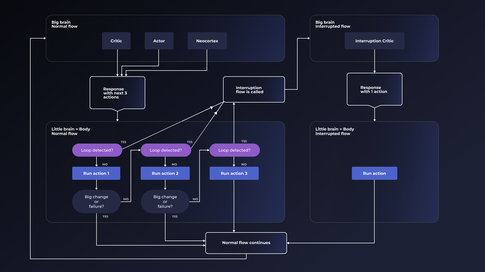
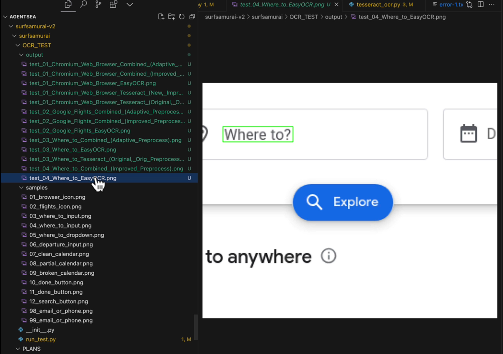
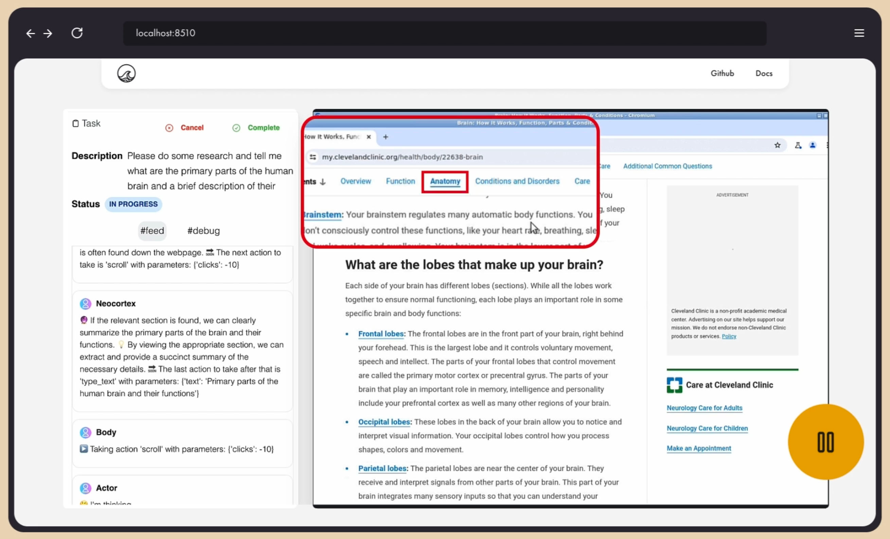
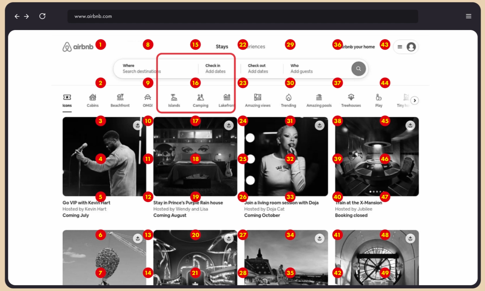
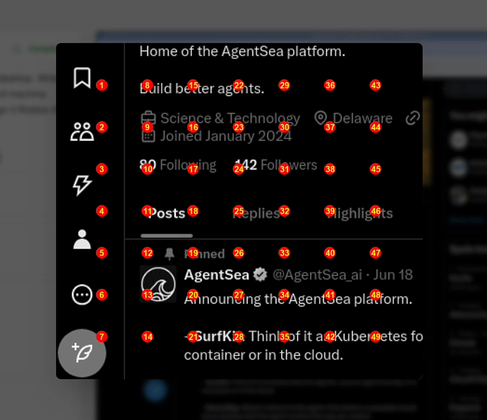
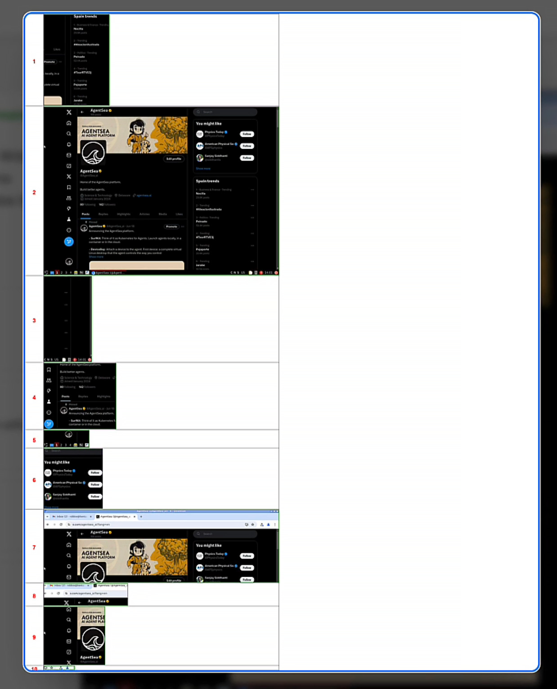

Meet Robbie, our Gen 2 agent.

He's available [right now on Github](https://github.com/agentsea/robbie-g2/) and he's completely open source.

You can download him immedietly and modify him and send him out into the wide world of the web to do tasks for you. Robbie navigates GUIs to solve tasks for you and he runs on top of various tools from our AgentSea stack. 

Check out our [Deep Dive video](https://youtu.be/R6rR27I6oFg), and you'll find even deeper dive right here in this article.

Let's walk through a bunch of techniques we use to help him on his way, which we've pioneered over the last few months. 

# The Mind of Robbie

While many teams are using the "team of agents" approach, like the excellent CrewAI team, and getting some cool results, we prefer modeling the parts of the brain in our agents, similar to the "thousand brains" approach of making decisions through consensus of different parts of the "mind" of the agent that excel at different pieces of the puzzle.

We divide our Gen 2 agent into the following:

* Actor
* Critic
* Neocortex
* Body



The **actor** is the primary decision maker of the agent.  He makes all the decisions and takes actions in the real world.

The **critic** studies actions and considers whether they were a success or failure as well as alternative paths and ideas.

The **neocortex** does a lot of things in the human brain, as it takes up over 70% of the space in our heads, but in our case we use the neocortex to predict the next few actions.  The neocortex is the seat of "simulations" into the future, letting us make decisions in real life before we make them and play out how it might go, so we can pick better actions. 

In later versions we will make a more complex long term and short term prediction system but in this case, just predicting they you have to first type a search into Google and then hit the search button is pretty strong for us already.

The **body** takes actions through its tools, in this case the virtual desktop served up by AgentDesk.

It's a hacky approximation of some of the concepts in [Yann LeCun's next-gen neural architectures](https://ai.meta.com/blog/yann-lecun-advances-in-ai-research/) and it also takes inspiration from [Richard Sutton's reinforcement learning](https://web.stanford.edu/class/psych209/Readings/SuttonBartoIPRLBook2ndEd.pdf) work and builds into our own next-gen architecture which we'll share later in the post.

Again we're not training novel architectures, but as an applied AI team, we're doing what humans do best, we're abstracting ideas and applying them in new and novel ways.

Now let's jump in and see through Robbie's eyes.

# How Robbie Sees the World

Robbie is a pure multimodal bot. 

Like a Tesla car, he makes decisions only by what he sees and reads.

Most of the agents out there today use something like Playwright to script browser interactions. That's a cool approach and you can easily use Playwright as a loadable device/tool in the AgentSea ToolFuse protocol but this doesn't help if you want to click around a desktop or a mobile app.  For that we knew we needed a pure multimodal approach. 

Just one problem.

We discovered that models like GPT-4/4o and Claude Opus/Sonnet are absolutely terrible at three key things:

* Returning coordinates
* Moving the mouse
* Drawing bounding boxes. 

The reasons shouldn't be surprising.  They just weren't trained to do any of these things.

But we've pioneered a number of tricks to help the models give us what we need to get through a GUI dynamically. 

We divide our techniques into "cheap" and "expensive." We don't mean money wise, although these agents can eat tokens like Pac Man so they can be expensive that way too. 

* By "cheap" we mean quick, dirty and fast.
* By "expensive" we mean round trips to the cloud and using heavier/slower frontier models or big open source models to get what we want. 

We try to use as many cheap methods as possible because they are much faster.  There are a number of ways to squeeze amazing results out of smaller, cheaper, faster methods and classical computer vision if you get creative, which is the essence of applied AI.

But for approximations of higher intelligence you need the much slower frontier models and there is no getting around it and that means everything slows down considerably because of round trips to the cloud and the slow inference of these models.

Robbie uses three major techniques to navigate the web:

### OCR Positioning

This is our absolute favorite cheap method and it’s lightning fast when it works. 

A few months ago I wondered if we could use the position of OCRed text as a way to get coordinates for buttons and links.  Turns out we can.  Many models and libraries like, [Tesseract](https://pypi.org/project/pytesseract/), support getting text position back. 

Unfortunately, most of them are not very good at accurately OCRing and giving coordinates.  That set us off on a search to find the right model. Some were too big and too slow and most of them just, well, kinda sucked. 

And then we hit on [EasyOCR](https://github.com/JaidedAI/EasyOCR). 

It is *God like* at finding text accurately and it is super fast and lightweight. 

When we first ran it through our test suite of GUI images and it came back with 100% we thought it was a mistake but subsequent tests proved its very strong (though not 100% in real world settings by any means.)



If the element on the page has text it is usually easy to find.  The MLLM tells us what is it looking for with its next action description and if we find a match we can easily click it quickly without more round trips to the Big Brain in the cloud.



### The Grid at the Center of it All

While models are not very good at knowing precisely where to click they are good at knowing approximately where to click.  They can tell you that the search button is in the middle of the page or on the lower left corner.

So we help the model do this with much better precision by layering a bunch of dots with over the image and ask it to pick the number closest to the thing its looking for right now.

Honestly, it’s easier to show than to explain because it makes intuitive sense when you see it:



From there we can progressively zoom, based on the number the model returns, overlaying the screenshot again, to get more granular and zero in on what we want to click.  In the below screenshot, you see a second level zoom on Twitter as the model looks to find the "compose tweet" button.



This approach is slow but it works very, very well. 

It's biggest downside is it's "expensive" in that it involves as many as three round trips to the cloud to talk to the Big Brain in the sky.

### Region of Interest

Region of insert is a hybrid classic computer vision and Big Brain in the cloud approach.  It's faster than grid but still slower than OCR.

In essence, it involves using canny in opencv to find all the right bounding boxes and then intelligently splitting the regions so that they show entire sections without cutting off parts of the piece of the puzzle the model is looking for at the moment.

We then layer all these regions onto a grid that we call the "Jeffries Composite" and asking the model to pick the number that has the element it wants.  Again, it is easier to just show you:



In older versions of our agents, our desktop slicer often cut right through the element we were looking and so that search bar or button spawned two or three boxes, which confused the model.  By intelligently not cutting something that is in the middle of a bounding box, we now get very clear sections of the image to work with 95% of the time.

Combined, these three techniques do very well at finding their way around a GUI, even without any model fine tuning (which we're working on too and [you can read about here](https://huggingface.co/collections/agentsea/waveui-6684c5ab7b72cda3a523674c).)

Fine tuning will give us a much faster and more robust clicking model and we'll fall back to these classical techniques as needed in v3.

## Running Robbie Gen 2

### Setup 

1. Setup your OpenAI API key:

```sh
export OPENAI_API_KEY=<your key>
```

2. Install/upgrade SurfKit:

```sh
pip install -U surfkit
```

3. Clone the repository and go to the root folder:

```sh
git clone git@github.com:agentsea/robbie-g2.git && cd robbie-g2
```

4. Install dependencies:

```sh
poetry install
```

### Creating required entities

5. Create a tracker:

```sh
surfkit create tracker --name tracker01
```

6. Create a device:

  - If you are using QEMU:

```sh
surfkit create device --provider qemu --name device01
```

  - If you are using GCE:

```sh
surfkit create device --provider gce --name device01
```

  - If you are using AWS:

```sh
surfkit create device --provider aws --name device01
```

7. Create an agent:

```sh
surfkit create agent --name agent01
```

### Solving a task

```sh
surfkit solve "Search for common varieties of french ducks" \
  --tracker tracker01 \
  --device device01 \
  --agent agent01
```


